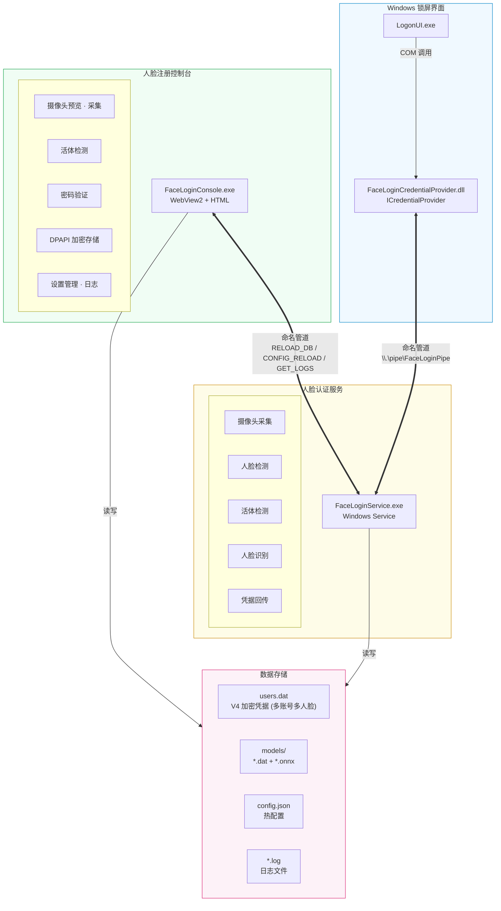
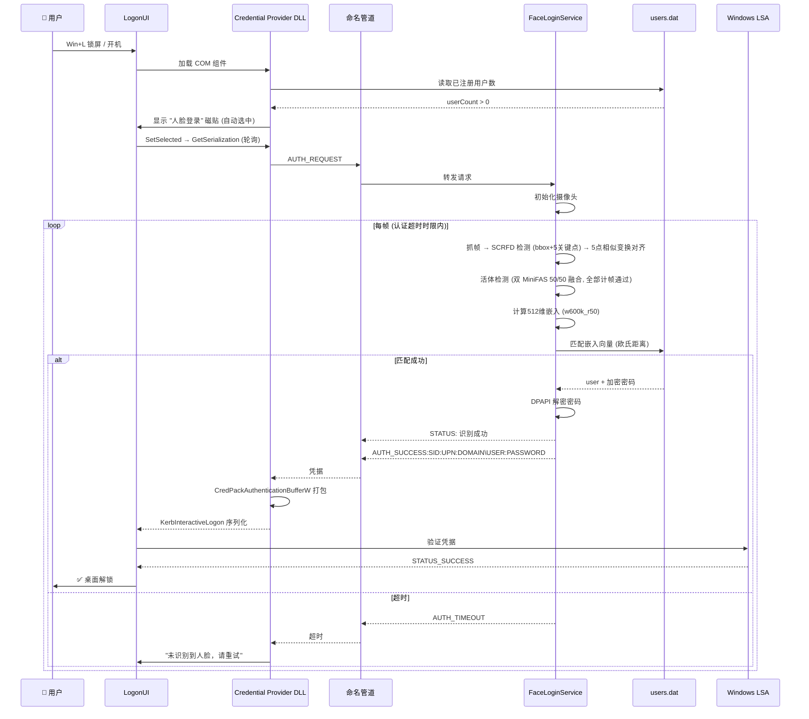
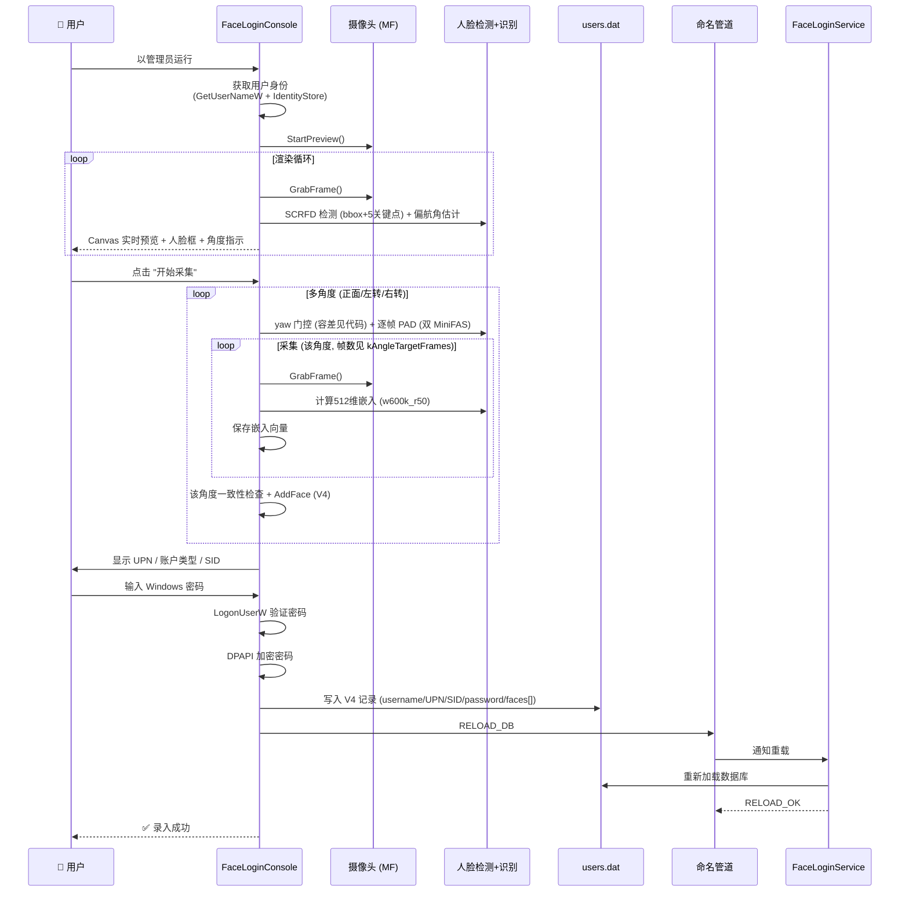

# FaceLogin 技术开发文档

本文件是 **AI 编码 agent 与开发者的代码导航索引**——"要改 X → 去哪个文件 → 这个文件长什么样"。逐文件索引 + 协议规格集中在此。

人类向内容已按职责拆分到 `docs/`：
- [`docs/design/overview.md`](docs/design/overview.md) —— 项目简介、技术栈、安全设计、账户兼容性
- [`docs/design/development.md`](docs/design/development.md) —— 本地开发流程、编码规范
- [`docs/operations/operations.md`](docs/operations/operations.md) —— 系统要求、故障排查
- [`docs/BUILD.md`](docs/BUILD.md) —— 构建/重编/打包流程

---

## 一、项目结构

```
FaceLogin/
├── CMakeLists.txt                  # 根构建文件
├── vcpkg.json                      # vcpkg 依赖定义 (onnxruntime)
├── .gitignore
├── common/                         # 公共库 (facelogin_common)
│   ├── CMakeLists.txt
│   ├── logger.cpp/h                # 文件日志系统（线程安全）
│   ├── ipc_protocol.cpp/h          # 命名管道 IPC 协议定义与解析
│   ├── dpapi_util.cpp/h            # DPAPI 加密/解密工具
│   ├── config_util.cpp/h           # 应用配置 JSON 序列化
│   └── registry_util.h             # 注册表读写工具
├── face_service/                   # 人脸识别 Windows 服务
│   ├── CMakeLists.txt
│   ├── main.cpp                    # 服务入口 (SCM / standalone)
│   ├── FaceService.cpp/h           # 服务核心逻辑 + 认证主循环
│   ├── face_align.h                # 5点相似变换对齐 + 偏航角估计 (header-only)
│   ├── liveness_types.h            # 活体检测方法枚举
│   ├── onnx_models.cpp/h           # ONNX 模型封装 (SCRFD gnkps / w600k_r50 / 双 MiniFAS)
│   ├── webcam_capture.cpp/h        # Media Foundation 摄像头
│   ├── webcam_capture_dshow.cpp/h  # DirectShow 摄像头 (Session 0 服务模式)
│   ├── pipe_server.cpp/h           # 命名管道服务端 (DACL安全)
│   └── credential_store.cpp/h      # 用户凭据数据库 (V4格式, 每账号多人脸)
├── credential_provider/            # Windows 登录界面 COM 组件
│   ├── CMakeLists.txt
│   ├── dllmain.cpp                 # DLL 入口 + COM 注册/注销
│   ├── FaceLoginProvider.cpp/h     # ICredentialProvider 实现
│   ├── FaceLoginCredential.cpp/h   # ICredentialProviderCredential 状态机
│   ├── pipe_client.cpp/h           # 命名管道客户端 (异步状态推送)
│   ├── credential_provider.def     # DLL 导出定义
│   ├── resource.h                  # 资源ID定义 (含CLSID GUID)
│   └── resource.rc                 # 资源文件
├── enrollment_app/                 # 人脸注册控制台 (WebView2 GUI)
│   ├── CMakeLists.txt
│   ├── main.cpp                    # WinMain 入口 + 管理员权限检查
│   ├── EnrollmentWizard.cpp/h      # 注册向导后端 (摄像头/检测/活体/存储)
│   ├── WebviewHost.cpp/h           # WebView2 宿主 + IDispatch 桥接 (33个JS接口)
│   ├── index.html                  # 嵌入式前端 UI (录入/设置/日志)
│   ├── FaceLoginEnrollment.manifest # 高DPI感知清单
│   ├── resource.h                  # 资源ID
│   ├── resource.rc                 # 资源 (嵌入 index.html)
│   └── webview2/                   # WebView2 SDK 头文件
├── installer/                      # 安装程序 (Go Wails v2)
│   ├── FaceLoginSetup/
│   │   ├── app.go                  # 安装/卸载/文件夹选择逻辑
│   │   ├── main.go                 # Wails 入口
│   │   ├── frontend/src/App.vue    # Vue 3 安装界面
│   │   ├── internal/               # 内部工具包
│   │   │   ├── com.go              # COM DLL 注册/注销
│   │   │   ├── elevate.go          # 管理员权限提权
│   │   │   ├── extract.go          # 嵌入式资源提取
│   │   │   ├── scm.go              # Windows 服务管理
│   │   │   └── util.go             # 注册表操作 + 目录权限
│   │   └── resources/              # 部署文件 (编译时嵌入)
│   └── wails.json                  # Wails 项目配置
├── scripts/                        # 辅助脚本
│   ├── download_models.ps1         # 下载、规范化并校验四个正式模型
│   └── start_standalone.bat        # 开发模式快速启动
└── assets/                         # 静态资源
    └── models/                     # 四个正式 ONNX 模型的唯一来源
```

---

## 二、模块架构

### 2.1 整体架构图



### 2.2 数据流

#### 认证流程 (Login / Unlock)



#### 注册流程 (Enrollment)



---

## 三、公共库 — `common/`

<a id="sec-logger"></a>
### 3.1 日志系统 (`logger.h/cpp`)

单例模式日志系统，线程安全（CRITICAL_SECTION）。

```cpp
namespace facelogin {
enum class LogLevel { Debug, Info, Warning, Error };

class Logger {
public:
    static Logger& Instance();
    void SetLogFile(const std::wstring& path);
    void SetMinLevel(LogLevel level);
    void SetEnableDebugOutput(bool enable);  // 同时输出到 DebugOutput
    void Log(LogLevel level, const wchar_t* format, ...);
};
}

// 便捷宏 (自动携带 __FUNCTION__ 和 __LINE__)
FACELOGIN_DEBUG(L"...");
FACELOGIN_INFO(L"...");
FACELOGIN_WARN(L"...");
FACELOGIN_ERROR(L"...");
```

**特性**：
- 同时输出到文件和控制台 (Debug 模式)
- 时间戳精度到毫秒
- 线程安全写入
- 每个进程独立日志文件 (service.log / credential_provider.log / enrollment.log)

**日志目录决策**（Logger 自身不决定目录，由三个调用方各自解析后传 `SetLogFile`）：

| 组件 | 路径解析 | 位置 |
|------|----------|------|
| credential_provider DLL（锁屏） | `DataPath` → `%ProgramData%\FaceLogin` → 硬编码 `C:\ProgramData\FaceLogin` | dllmain.cpp:98-109 |
| EnrollmentWizard | 同上（DataPath → ProgramData → 硬编码） | EnrollmentWizard.cpp:165-179 |
| face_service（service 模式） | `ResolveSecureDataDir()`，白名单校验失败 **fail-closed 拒绝启动**，不回退 | FaceService.cpp:297-324 |
| face_service（standalone 开发） | `ResolveSecureDataDir()` → 失败回退 EXE 目录 → 兜底 `.`（cwd） | FaceService.cpp:189-216 |

> **关键事实：生产部署下三个日志都写在 `C:\Program Files\FaceLogin\log\`**，不在 ProgramData。因为安装器把 `DataPath` 写成安装目录本身（见 §7.6 提示）。ProgramData 只是 DataPath 为空时的回退。
>
> **三组件不一致（隐蔽坑）**：`data_path.h` 注释描述的"生产态白名单只信 EXE 目录、ProgramData 被拒"**只对 face_service 生效**。credential_provider DLL 和 EnrollmentWizard **直接读 DataPath，不做白名单校验**——只是因为默认 DataPath = 安装目录，结果才一致。改日志/数据路径相关逻辑时，三个调用方都要看，不要只看 `data_path.cpp`。
>
> **写失败静默丢弃**：`SetLogFile` 里 `CreateFileW` 若返回 INVALID_HANDLE_VALUE（路径不可写/无权限），`WriteToFile` 静默丢弃日志，不报错（logger.cpp:133-150）。排查"日志没生成"时先查目标目录的 ACL 与 DataPath 实际值，不要只看有没有异常。

<a id="sec-ipc"></a>
### 3.2 IPC 协议 (`ipc_protocol.h/cpp`)

传输层基于 Windows 命名管道 `\\.\pipe\FaceLoginPipe`。

| 消息 | 格式 | 说明 |
|---|---|---|
| `AUTH_REQUEST` | 纯文本 | 凭据提供方发起认证请求 |
| `AUTH_SUCCESS:SID:UPN:DOMAIN\USER:PASSWORD` | 冒号分隔 (≥3个) | 认证成功，返回凭据（V4格式含SID/UPN/人脸ID） |
| `AUTH_SUCCESS:DOMAIN\USER:PASSWORD` | 冒号分隔 (1个) | 旧格式（V1向后兼容） |
| `AUTH_TIMEOUT` | 纯文本 | 认证超时（超时时限见代码），未检测到匹配人脸 |
| `AUTH_NO_FACE` | 纯文本 | 检测超时无匹配 |
| `AUTH_ERROR:message` | 前缀+消息 | 错误状态 |
| `AUTH_CANCELLED` | 纯文本 | 用户取消 |
| `STATUS:text` | 前缀+消息 | 实时状态推送 |
| `RELOAD_DB` / `RELOAD_OK` | 纯文本 | 重载用户数据库 |
| `CONFIG_RELOAD` / `CONFIG_RELOAD_OK` / `CONFIG_RELOAD_ERROR` | 纯文本 | 重载配置文件（活体方法不支持或双 MiniFAS 模型缺失时返回 `CONFIG_RELOAD_ERROR`，认证保持 fail-closed） |
| `GET_LOGS` / `GET_LOGS_OK:json` | 纯文本/JSON | 获取服务端日志 |
| `PING` / `PONG` | 纯文本 | 连接存活检测 |

**安全措施**：
- DACL: 仅 SYSTEM + Administrators 可连接
- `PIPE_REJECT_REMOTE_CLIENTS`: 拒绝远程客户端
- 缓冲区大小: 见代码常量
- 超时: 见代码常量
- 密码传输后立即 `SecureZeroMemory` 擦除

**AuthResult 结构**:
```cpp
struct AuthResult {
    enum class Status { Success, Timeout, NoFace, Error, Cancelled };
    Status status;
    std::wstring sid;      // S-1-5-21-... (V2)
    std::wstring upn;      // user@domain (V2, 可为空)
    std::wstring domain;
    std::wstring username;
    std::wstring password; // 使用后清零!
    std::wstring errorMessage;
};
```

### 3.3 DPAPI 加密 (`dpapi_util.h/cpp`)

使用 Windows Data Protection API。

- **Protect()**: `CRYPTPROTECT_LOCAL_MACHINE` — 机器范围加密，SYSTEM 账户和服务均可解密
- **Unprotect()**: 解密已保护的数据
- 加密后数据以二进制格式存入 `users.dat`

<a id="sec-config"></a>
### 3.4 配置系统 (`config_util.h/cpp`)

```cpp
struct AppConfig {
    std::string    recognition_model      = "onnx";      // 保留兼容（dlib 识别器已移除，仅 onnx 有效）
    std::string    detector               = "scrfd";     // 保留兼容（dlib HOG 检测器已移除，仅 scrfd 有效）
    LivenessMethod liveness_method        = LivenessMethod::AntiSpoof;
    float          match_threshold        = 0.80f;      // 512-D 欧氏距离阈值（可配置，EmbeddingThresholdForDim 钳制）
    float          anti_spoof_threshold   = 0.281f;      // 校准后的 50/50 双 MiniFAS 融合阈值
    bool           low_light_enhance      = false;       // 暗光增强（仅作用于识别嵌入，不影响 PAD）
    std::string    camera_device          = "";          // 设备符号链接；空 = 首个摄像头
    int            camera_rotation        = 0;           // 0/90/180/270 度
};

enum class LivenessMethod {
    AntiSpoof,   // ONNX 静默反欺诈 (MiniFASNetV2 + MiniFASNetV1SE 50/50 融合) — 唯一支持项
    Blink,       // EAR 眨眼检测（已随 dlib 68 点移除，配置值自动映射到 AntiSpoof 并告警）
    None         // 无活体检查（已禁止：配置归一化为 AntiSpoof）
};
```

配置文件位置: `%PROGRAMDATA%\FaceLogin\data\config.json`

---

## 四、人脸识别服务 — `face_service/`

### 4.1 服务入口 (`main.cpp`)

```
用法:
  FaceLoginService.exe                   作为 Windows 服务运行 (SCM)
  FaceLoginService.exe -install          安装服务
  FaceLoginService.exe -uninstall        卸载服务
  FaceLoginService.exe -standalone       前台运行 (开发测试)
```

**单实例保护**: 全局命名互斥体 `Global\FaceLoginService_SingleInstance`

### 4.2 服务核心 (`FaceService.h/cpp`)

**生命周期**:

```
ServiceMain()
  ├─ RegisterServiceCtrlHandlerEx()
  ├─ Initialize()
  │   ├─ 创建数据目录 + 加载配置
  │   ├─ 加载凭据数据库 (CredentialStore, V4, 每账号多人脸)
  │   ├─ 初始化人脸检测器 (FaceDetector / OnnxDetector)
  │   ├─ 初始化人脸识别器 (FaceRecognizer / OnnxRecognizer)
  │   ├─ 初始化活体检测器 (LivenessDetector / OnnxAntiSpoof)
  │   ├─ 初始化摄像头 (DirectShow 用于服务模式 / MF 用于 standalone)
  │   └─ 创建管道服务端 (PipeServer)
  └─ Run()
      └─ 循环: WaitForClient → ReadMessage → ProcessAuthRequest → Disconnect

服务控制:
  - SERVICE_ACCEPT_STOP | SERVICE_ACCEPT_SHUTDOWN
  - 故障恢复: 3次重启, 间隔60秒, 重置周期24小时
```

**认证流程 (`ProcessAuthRequest`)**:

```
1. 检查注册用户数 > 0
2. 活体方法强制为 antispoof（dlib 识别器/HOG 检测器已移除，系统为纯 ONNX）
3. 延时初始化摄像头 (仅在收到认证请求时打开，避免摄像头占用)
4. 丢弃若干帧用于自动曝光调整（帧数见代码）
5. 重置活体检测器
6. 融合循环 (全局超时 `m_authTimeoutSeconds`；PAD 另有独立时间窗口)，要求所有计帧全部通过：
   a. 抓取一帧
   b. SCRFD gnkps 检测 (bbox + 5 关键点)；检测最大人脸
   c. 5 点相似变换对齐到 112×112（无独立地标模型）
   d. 活体检测 (双 MiniFAS 50/50 融合，帧间间隔见代码)
   e. 身份绑定：**仅在部分绑定帧**计算 512 维嵌入向量 (InsightFace w600k_r50) → 数据库匹配。首帧锚定 SID；后续绑定帧必须返回同一 SID，否则 fail-closed（换脸拒绝）。末帧即最终身份门（无独立 post-liveness 验证，已删除）
   f. 非绑定帧用 bbox IoU 连续性校验；未匹配的绑定帧滑出计数不增 totalChecked
   g. 匹配成功 (欧氏距离 < 阈值[可配置，钳制区间见代码] + 最佳/次佳比门控) → 构建 AUTH_SUCCESS → 发送凭据 → 退出
   h. 嵌入次数与优化轨迹见 `docs/performance-baseline.md`
7. 超时 → 发送 AUTH_TIMEOUT
8. 完成后关闭摄像头，释放资源
```

**双模式摄像头**:

| 属性 | Media Foundation (MF) | DirectShow (DS) |
|---|---|---|
| 使用场景 | standalone 模式 + enrollment | 服务模式 (Session 0) |
| COM线程模型 | MTA | COINIT_MULTITHREADED |
| 颜色格式 | NV12 → RGB | RGB24 |
| Session 0 支持 | ❌ | ✅ |
| 分辨率 | 见代码默认配置 | 见代码默认配置 |

**配置项**: 见 §3.4 `AppConfig` 结构（通过 config.json + `CONFIG_RELOAD` 热加载）。

### 4.3 人脸对齐 (`face_align.h`)

v1.5 起不再使用 dlib 68 点形状预测器。SCRFD (gnkps 变体) 直接输出 5 关键点（左右眼/鼻/左右嘴角），对齐由纯几何完成:

```cpp
bool EstimateSimilarityTransform(const float src[10], const float dst[10], float out[6]);
void WarpAffine(const FrameImage& image, const float m[6], int size, ...);   // FrameImage = common/frame_image.h
float EstimateYawDeg(const float kps[10]);   // 偏航角估计 (弱透视模型, k=1.86 实测标定)
```

**原理**: 5 点 → InsightFace 标准参考框 (112×112) 的最小二乘相似变换（旋转+等比缩放+平移，无剪切），双线性逆映射采样。偏航角 = atan(k·鼻尖水平偏移/视眼距)（k = 眼距/鼻突 ≈ 65/35mm ≈ 1.86，`kYawCalibration`），符号约定：头转向自己左侧为正。

### 4.4 人脸识别 (`onnx_models.h/cpp`)

```cpp
class OnnxRecognizer {
    // InsightFace w600k_r50 ONNX (512-D embedding)
};
```

**初始化**: 加载 `w600k_r50.onnx` (ONNX Runtime, ~44 MB INT8 量化版)

**嵌入计算**: 输入对齐后的 112×112 帧 → 输出 512 维浮点向量 (L2 归一化)

**匹配**: 欧氏距离比对（阈值见 `match_threshold`，实测同人边界见 credential_store.h）。同时检查最佳匹配 / 次佳匹配比门控（防误匹配）。

### 4.5 活体检测

双 MiniFAS (V2+V1SE) 50/50 融合，要求**所有计帧全部通过**（fail-closed）。方法枚举与 `blink→antispoof` 映射见 §3.4 `LivenessMethod`；阈值见 `anti_spoof_threshold`。

### 4.6 ONNX 模型 (`onnx_models.h/cpp`)

封装三个 ONNX 推理引擎:

| 类 | 模型 | 输入 | 输出 | 用途 |
|---|---|---|---|---|
| `OnnxDetector` | SCRFD gnkps (`det_10g_gnkps.onnx`) | 512×512 直接拉伸（动态维度图） | 检测框+5点关键点 | 人脸检测 |
| `OnnxRecognizer` | InsightFace buffalo_l (`w600k_r50.onnx`) | 112×112 对齐人脸 | 512维嵌入 | 人脸识别 |
| `OnnxAntiSpoof` | `MiniFASNetV2.onnx` + `MiniFASNetV1SE.onnx` | bbox 扩展裁剪（2.7× / 4.0×） | 50/50 融合活体分数 [0,1] | 静默反欺诈 |

所有 ONNX 模型放置在 `%PROGRAMDATA%\FaceLogin\models\` 下。

<a id="sec-credential-store"></a>
### 4.7 凭据存储 (`face_service/credential_store.h/cpp`)

**V4 二进制文件格式** (`users.dat`):

```
[Header]
  magic:     uint32_t  0x474F4C46 ("FLOG")
  version:   uint32_t  4
  count:     uint32_t  (有脸账号数量)

[Records] × count
  usernameLen:    uint32_t
  username:       wchar_t[usernameLen]    (UTF-16LE)
  upnLen:         uint32_t                (V2+)
  upn:            wchar_t[upnLen]         (V2+, e.g. "user@outlook.com")
  sidLen:         uint32_t                (V2+)
  sid:            wchar_t[sidLen]         (V2+, e.g. "S-1-5-21-...")
  passwordLen:    uint32_t
  encryptedPass:  uint8_t[passwordLen]    (DPAPI 加密，或 0/1 字节 passwordless 哨兵)
  faceCount:      uint32_t                (V4, ≥1, ≤ kMaxFacesPerUser)
  [faces] × faceCount:
    faceId:       uint32_t                (V4, 账号内唯一，≥1，新脸复用最小空位，保持紧凑)
    labelLen:     uint32_t                (V4, 0 = 空)
    label:        wchar_t[labelLen]       (V4, 用户命名，默认 "脸N")
    embLen:       uint32_t
    embedding:    float[embLen]           (512-D ONNX / 128-D 旧 dlib)
```

**V1/V2/V3 向后兼容**: V1 加载时用 `LookupAccountNameW` + IdentityStore 注册表自动补 SID/UPN；V1/V2 固定 128-D embedding，V3 长度前缀 embedding。**加载时在内存中把单条 embedding 包装成单元素 `faces`（id=1，label="脸1"）升级为 V4 结构，但不写回磁盘**——文件保持旧版本直到下一次 `SaveDatabase()`（录入/删除时）才写为 V4。这保证旧版安装的磁贴仍可读取 header。

**每账号多人脸**: `UserRecord.faces` 为 `vector<FaceRecord>`（`FaceRecord = {id, label, embedding}`）。`AddFace` 是 create-or-append：账号不存在则创建（首脸 id=1），存在则追加新脸（id=最小空位，删除后补录保持紧凑）且**不动已存密码**；全局 `kMaxUsers` 账号上限、每账号 `kMaxFacesPerUser` 脸数上限（具体数值见代码常量），超限拒绝。`DeleteFace` 删某张脸，删后无脸则连带移除整个账号（0 脸账号永不落盘）。`ClearFacesForAccount` 清空某账号全部脸但保留身份/密码（多角度重录入替换用）；`ClearAllFaces`/`DeleteUserBySid` 等同删整个账号；`UpdateAccountIdentity` 原地更新身份+密码但**保留全部已录人脸**（MSA→local 切换清 UPN 用）；`RenameFace` 改脸标签（人脸管理 UI 用）。所有写操作改后须显式调 `SaveDatabase()` 落盘。匹配为账号级聚合：账号内取各脸最小距离作为账号距离，账号间比较 best/second-best，避免同账号多脸互相竞争抬高 ratio（单账号场景总通过）。

**阈值钳制**: `EmbeddingThresholdForDim`（credential_store.h 顶部）对 512-D ONNX 把配置阈值钳制到安全带，越界回退默认值（含 legacy dlib 默认）；128-D dlib / 未知维度原样返回。具体区间/回退值与标定依据见代码及 `docs/threshold-calibration.md`。

**认证流水线默认阈值速查**: 以下为代码实测值（非推测），改认证/活体逻辑时直接对这张表。标定方法与依据见 `docs/threshold-calibration.md`。

| 参数 | 默认值 | 钳制/约束 | 可配置 | 标识符（位置） |
|------|--------|-----------|--------|----------------|
| 人脸匹配欧氏距离阈值 | `0.80` | 加载时 `[0.70, 1.00]`，越界**回退 0.80**（不钳到边界）；匹配时 `EmbeddingThresholdForDim` 再次收口 | 是（config.json `match_threshold`，注册表 `MatchThreshold` DWORD/100） | `AppConfig::match_threshold`（config_util.h:15）；钳制 config_util.cpp:147-152 + credential_store.h:32-40 |
| 活体（PAD）阈值 | `0.281` | 无（越界不校正，但融合分数 fail-closed 校验 [0,1]） | 是（config.json `anti_spoof_threshold`） | `AppConfig::anti_spoof_threshold`（config_util.h:16） |
| 最佳/次佳比门控 | `0.75`（`bestDist/secondBestDist >= 0.75` → **拒绝**） | 仅 `comparableAccounts > 1` 时启用 | 否（硬编码） | 局部 `ratio`，credential_store.cpp:624-625 |
| 双 MiniFAS 融合权重 | `0.5 / 0.5`（算术平均） | 单分数非 [0,1] 或非有限 → fail-closed 返回 `-1.0` | 否 | `fusedScore = (v2+v1se)*0.5f`，onnx_models.cpp:673 |
| SCRFD 检测分数阈值 | `0.5` | — | 否（constexpr） | `kScoreThreshold`，onnx_models.cpp:321 |
| SCRFD NMS IoU | `0.5` | — | 否（constexpr） | `kNmsIoU`，onnx_models.cpp:389 |
| PAD 帧数要求 | 5 帧须全过（5/5） | 全计帧必须通过 | 否 | `AntiSpoofCheckCount`/`AntiSpoofPassRequired`，liveness_types.h:13-19 |
| 全局认证超时 | `15 s`（挂钟，从 `startTime` 起） | 在融合活体+一致性循环内检查 | 否（成员默认） | `m_authTimeoutSeconds`，FaceService.h:103 / .cpp:936 |
| PAD 独立时间窗 | `8 s`（与注册端 EnrollmentWizard 对齐） | 超 8s 即便未到全局超时也退出 PAD 循环 | 否（字面量） | FaceService.cpp:946 |
| 快速失败：全程无人脸 | `2.5 s` | — | 否（字面量） | FaceService.cpp:959 |
| 快速失败：持续 PAD 拒绝（有人脸但 passCount==0） | `2.0 s` | — | 否（字面量） | FaceService.cpp:987 |

> 提示：`FaceService.h` 中 `m_matchThreshold` 的成员初始化器写的是 `0.30f`，但这是**死代码**——`Initialize`/reload 时立即被 `m_config.match_threshold`(0.80) 覆盖，运行时实际阈值永远是后者。读代码时不要被 0.30 误导。

**线程安全**: 所有操作在调用者持有锁的前提下执行。服务端在主循环中串行处理请求，无并发写入场景；唯一写者是录入控制台（单写者）。

**MatchResult**: 匹配时返回 `username / upn / sid / password(解密后) / passwordless / distance`，密码使用后立即 `SecureZeroMemory` 擦除；`passwordless=true` 时**不得提交 LSA 凭据**。仅比较同维度 embedding，异维度跳过。

**CP 兼容**: `FaceLoginProvider::ReadUserCountFromDatabase` 只读 header（magic/version/count），接受 v1..v4。若旧版（≤1.2.0）CP 读到 v4 文件会拒绝显示磁贴（version>3 → 视为无用户），密码登录不受影响——安全回退。

### 4.8 命名管道服务端 (`pipe_server.h/cpp`)

```cpp
class PipeServer {
    bool WaitForClient(DWORD timeoutMs = 30000);
    bool ReadMessage(std::wstring& outMessage, DWORD timeoutMs = 30000);
    bool WriteMessage(const std::wstring& message);
    void Disconnect();
    void Close();
};
```

**安全措施**:
- `SECURITY_ATTRIBUTES` 带自定义 DACL：仅 SYSTEM + Administrators
- `PIPE_REJECT_REMOTE_CLIENTS`
- 管道实例: 1（单客户端模型，串行服务）
- 缓冲区: 见代码常量

---

## 五、凭据提供方 — `credential_provider/`

### 5.1 COM 注册 (`dllmain.cpp`)

**CLSID**: `{B8F4C7A1-3D5E-4F2B-A9C6-1D8E7F3A5B2C}`

**注册路径**:
```
HKEY_CLASSES_ROOT\CLSID\{GUID}\InprocServer32 → DLL 路径 (Apartment 模型)
HKEY_LOCAL_MACHINE\SOFTWARE\Microsoft\Windows\CurrentVersion\
  Authentication\Credential Providers\{GUID} → "FaceLogin Credential Provider"
```

**导出函数**: `DllGetClassObject`, `DllCanUnloadNow`, `DllRegisterServer`, `DllUnregisterServer`

### 5.2 凭据提供方 (`FaceLoginProvider.h/cpp`)

实现 `ICredentialProvider` 接口。

**磁贴字段** (4个):

| 字段ID | 类型 | 标签 | 说明 |
|---|---|---|---|
| 0 | CPFT_LARGE_TEXT | 人脸登录 | 磁贴标题 |
| 1 | CPFT_SMALL_TEXT | 状态 | 实时状态信息 |
| 2 | CPFT_SUBMIT_BUTTON | 提交 | 隐藏的提交按钮 |
| 3 | CPFT_COMMAND_LINK | 切换到密码登录 | 备用登录方式 |

**自动登录**: `GetCredentialCount()` 返回 `pbAutoLogonWithDefault = TRUE`，系统自动选中此凭据。

**场景支持**: 支持 `CPUS_LOGON` 和 `CPUS_UNLOCK_WORKSTATION`。

**用户检测**: `ReadUserCountFromDatabase()` 读取 `users.dat` (支持 V1..V4)，无注册用户时返回 `E_NOTIMPL` 隐藏磁贴。

### 5.3 凭据磁贴 (`FaceLoginCredential.h/cpp`)

实现 `ICredentialProviderCredential` 接口，核心状态机:

```
状态转换:
  Waiting ──→ Authenticating ──→ Ready (认证成功, 凭据回传)
     │              │
     └──────────────┴────→ Failed (识别失败, 超时)
                           Error  (服务不可用)
```

**凭据打包 (`PackCredentials`)**:

1. 使用 `LsaConnectUntrusted` + `LsaLookupAuthenticationPackage("MICROSOFT_AUTHENTICATION_PACKAGE_V1_0")` 获取认证包
2. `CredPackAuthenticationBufferW(flags=0)` 打包 KERB_INTERACTIVE_LOGON
3. 本地账户: `Domain\Username` 格式
4. MSA 账户: 如有 UPN (含 `@`)，使用 UPN 格式
5. 打包后的凭据通过 `KerbInteractiveLogon` 序列化返回给 LSA

**多线程设计**:
- 主线程: LogonUI 调用 COM 接口方法
- 后台线程: 阻塞式 `ReadFile` 等待管道响应
- 同步: `CRITICAL_SECTION` 保护状态变量, `HANDLE m_hCredsReady` 事件通知
- 超时: 硬超时防止阻塞 LogonUI（时限见代码）

**状态文本** (中文):

| 状态 | 显示文本 |
|---|---|
| Waiting | 正在准备人脸识别... |
| Authenticating | 请注视摄像头以解锁 |
| Ready | 人脸识别成功，正在解锁... |
| Failed | 未识别到人脸，请重试或使用密码登录 |
| Error | 人脸登录服务不可用 |

### 5.4 管道客户端 (`pipe_client.h/cpp`)

```cpp
class PipeClient {
    bool Connect(DWORD timeoutMs = 5000);
    void StartBackgroundRead();      // 启动后台阻塞读取线程
    bool CheckResponse();            // 非阻塞轮询
};
```

**实时状态推送**: `STATUS:` 消息通过回调立即传递到 UI 更新显示文本，其余消息写入缓冲区并触发事件。

---

## 六、注册控制台 — `enrollment_app/`

### 6.1 程序入口 (`main.cpp`)

Win32 GUI 应用程序。

- 运行时检查管理员权限 (DPAPI 机器范围 + %PROGRAMDATA% 写入需要)
- 非管理员时自动通过 `ShellExecuteEx(runas)` 提权重启
- 检查模型文件是否存在（缺失时弹出提示）

### 6.2 注册向导 (`EnrollmentWizard.h/cpp`)

**身份获取** (构造函数):

```
1. GetUserNameW → SAM 用户名
2. GetUserNameExW(NameUserPrincipal) → UPN (secur32.dll 动态绑定)
3. GetUserNameExW(NameSamCompatible) → DOMAIN\User 格式
4. LookupAccountNameW → SID (通过 UPN 或 SAM 用户名)
5. 注册表 IdentityStore 回退 → MSA UPN (当 GetUserNameExW 失败时)
6. 账户类型判断: UPN 含 '@' → "msa", 否则 → "local"
```

**页面一：人脸采集**

- 摄像头 MF 采集，帧回调
- 实时 SCRFD gnkps 检测 (bbox + 5 关键点) + 偏航角估计 + 角度指示叠加（无 68 点地标模型）
- 多角度采集流程（正面/左转/右转，逐角度进行；目标偏航角与门控容差见代码）：
  1. 该角度 yaw 门控（无回退）+ 逐帧 PAD（双 MiniFAS 50/50 融合）
  2. 采集 512 维嵌入向量（每角度 `kAngleTargetFrames` 帧）
  3. 嵌入一致性检查（最大最小距离 < 阈值）
  4. 每角度独立 `AddFace`（V4），跨角度绝不平均

**页面二：密码录入**

- WebView2 界面显示 UPN、账户类型 (local/msa)、SID
- 密码验证: `LogonUserW` 支持本地账户和 MSA UPN 回退
- DPAPI 加密密码 → 更新 `users.dat` V4 格式 (含 SID/UPN/多人脸)
- 通过命名管道 `RELOAD_DB` 通知服务热加载

**JS 接口** (通过 COM IDispatch，共 33 个 dispId，见 `WebviewHost.cpp`):

| dispId | 方法 | 说明 |
|---|---|---|
| 1 | StartPreview | 启动摄像头预览 |
| 2 | StopPreview | 停止摄像头预览 |
| 3 | GetSampleCount | 获取采集样本数 |
| 4 | GetUsername | 获取用户名 (UPN/DOMAIN\User) |
| 5 | CaptureFaceSamples | 触发多角度采集 (阻塞) |
| 6 | ValidatePassword | 验证 Windows 密码 |
| 7 | SaveEnrollment | 保存注册数据 |
| 8 | GetLatestFrameBase64 | 获取当前帧 JPEG base64 |
| 9 | GetLatestFacesJson | 获取检测面部的 JSON |
| 10 | IsPreviewRunning | 预览是否运行中 |
| 11 | IsLivenessPassed | 活体检测是否通过 |
| 12 | IsLivenessChecking | 活体检测是否进行中 |
| 13 | GetConfig | 获取当前配置 JSON |
| 14 | SetConfig | 保存配置 JSON |
| 15 | GetLogLines | 获取控制台日志 JSON 数组 |
| 16 | GetServiceLogLines | 获取服务端日志 JSON 数组 |
| 17 | ClearLog | 清空日志 |
| 18 | GetUserSid | 获取当前用户 SID |
| 19 | GetAccountType | 获取账户类型 (local/msa) |
| 20 | GetLatestFrameAndFaces | 获取当前帧 + 检测面部 (合并) |
| 21 | GetCameraList | 获取可用摄像头列表 |
| 22 | GetPasswordlessState | 获取无密码账户状态 |
| 23 | SaveEnrollmentNoPassword | 无密码保存注册数据 (带 label) |
| 24 | GetFaceCount | 获取已录入人脸数 |
| 25 | GetFacesJson | 获取已录入人脸 JSON |
| 26 | SaveEnrollmentAppend | 追加保存新角度人脸 (带 label) |
| 27 | DeleteFace | 删除指定 faceId 的人脸 |
| 28 | ClearAllFaces | 清空当前账号所有人脸 |
| 29 | RenameFace | 重命名指定 faceId 的人脸 |
| 30 | CheckAccountTypeChanged | 检测账号类型是否变化 |
| 31 | RefreshAccountIdentity | 刷新账号身份信息 (带密码) |
| 32 | GetCaptureStatus | 获取采集状态 |
| 33 | ClearStaleAccountUpn | 清理过期账号 UPN |

### 6.3 WebView2 宿主 (`WebviewHost.h/cpp`)

- 创建 `ICoreWebView2Environment` + `ICoreWebView2Controller`
- 从嵌入资源加载 `index.html`
- 注册 `HostObject` (COM IDispatch) 作为 JS `window.chrome.webview.hostObjects.sync.host`
- 处理 `WM_WTSSESSION_CHANGE`: 锁屏时释放摄像头，解锁时恢复
- 禁用右键菜单和开发者工具

### 6.4 前端界面 (`index.html`)

嵌入式单页应用，三个标签页:

| 标签 | 功能 |
|---|---|
| 录入 | 摄像头预览 + Canvas 渲染 + 人脸框叠加 + 活体提示 + 采集进度 |
| 设置 | 识别模型 / 检测器 / 活体方法 / 反欺诈阈值 / 匹配严格度 |
| 日志 | Console 日志 / Service 日志切换 + 自动刷新 + 彩色等级显示 |

---

## 七、安装程序 — `installer/`

### 7.1 技术架构

基于 **Go Wails v2** 构建，前端使用 **Vue 3** 单文件组件。

| 层面 | 技术 |
|---|---|
| 后端 | Go + Wails v2 Runtime |
| 前端 | Vue 3 + Tailwind CSS + TypeScript |
| 打包 | Wails 构建 (Go 编译 + WebView2 嵌入) |
| 资源 | Go embed.FS 嵌入所有部署文件 (INT8 量化，体积随模型版本变化) |

### 7.2 命令行用法

```
FaceLoginSetup.exe          交互模式 (GUI)
```

<a id="sec-installer"></a>
### 7.3 安装流程

`App.Install`（`installer/FaceLoginSetup/app.go`）按序执行，模型校验与 ACL 保护分布在关键节点两侧：

| 步骤 | 操作 | 进度 | 备注 |
|---|---|---|---|
| 0 | 校验安装资源（内嵌模型的固定大小 + SHA-256） | 0% | `internal.ValidateEmbeddedResources`；在停止旧服务前执行，尽早发现损坏载荷 |
| 1 | 停止并删除已有服务 | 0-12% | `internal.StopAndDeleteService()` |
| 2 | 创建目标目录 | 12-25% | `os.MkdirAll` |
| 2.5 | 设置安装目录 ACL（预保护） | 25-30% | `internal.SetDirectoryACL`；在写入可执行文件/模型前锁定，使后续解压文件继承仅 SYSTEM/管理员写权限 |
| 3 | 写入注册表路径 (InstallPath, DataPath) | 30-35% | DataPath = 安装目录本身，C++ 端追加 `\models` |
| 4 | 提取所有嵌入文件 | 35-60% | `internal.ExtractAll` |
| 4.1 | 校验已复制模型（大小 + SHA-256） | — | `internal.ValidateInstalledModels`；与步骤 0 相同的固定哈希 |
| 4.5 | 写入默认 config.json（选择性强制本版调整的默认参数） | 60% | `internal.EnsureConfigDefaults` |
| 5 | 验证目录权限（递归后置 ACL） | 60-67% | `internal.SetDirectoryACL` 递归再校一次，防止解压文件携带意外显式 ACL |
| 6 | 注册 COM DLL (regsvr32) | 67-75% | `internal.RegisterCOMDLL` |
| 7 | 安装并启动 Windows 服务 | 75-90% | `internal.InstallService` |
| 8 | 最终化（补充解压 FaceLoginConsole.exe） | 90-100% | — |

### 7.4 卸载流程

卸载为**完全清除**：程序文件、`data/`（含 `users.dat` 已录入人脸、`config.json`）与 `log/` 一并删除，仅当安装目录变空时才移除目录本身（未知文件会保留目录）。前端在卸载前会向用户提示此后果。

| 步骤 | 操作 | 进度 |
|---|---|---|
| 1 | 停止并删除服务 | 0-30% |
| 2 | 注销 COM DLL | 30-50% |
| 3 | 删除程序文件 + 用户数据（`data/`、`log/`） | 50-70% |
| 4 | 清理注册表键值 (InstallPath, DataPath) | 70-85% |
| 5 | 完成（目录为空则移除） | 85-100% |

### 7.5 特殊功能

- **文件夹选择器**: 通过 `runtime.OpenDirectoryDialog` 调用原生文件夹选择器
- **安装检测**: 检查注册表 `InstallPath` 值 + 目录存在性，已安装时标签显示"更新"
- **进度推送**: 通过 Wails Events 实时推送安装进度到 Vue 前端

### 7.6 目录结构

```
C:\Program Files\FaceLogin\               # 安装目录 (= DataPath，用户可选)
├── FaceLoginService.exe
├── FaceLoginCredentialProvider.dll
├── FaceLoginConsole.exe
├── FaceLoginSetup.exe
├── openblas.dll
├── onnxruntime.dll
├── abseil_dll.dll
├── libprotobuf.dll
├── libprotobuf-lite.dll
├── re2.dll
├── libgfortran-5.dll
├── libquadmath-0.dll
├── libgcc_s_seh-1.dll
├── libwinpthread-1.dll
├── data/
│   ├── config.json                        # 热配置（CONFIG_RELOAD）
│   └── users.dat                          # V4 加密凭据数据库
├── log/                                   # ← 生产部署下三组件日志全部落在这里
│   ├── service.log
│   ├── credential_provider.log
│   └── enrollment.log
└── models/
    ├── det_10g_gnkps.onnx                           (~4.3 MB, INT8)
    ├── w600k_r50.onnx                               (~44 MB, INT8)
    ├── MiniFASNetV2.onnx                             (~1.74 MB)
    └── MiniFASNetV1SE.onnx                           (~1.74 MB)
```

> **注意：数据/日志默认在 Program Files 下，不在 ProgramData。** 安装器把 `HKLM\SOFTWARE\FaceLogin\DataPath` 写成安装目录本身（`app.go:125-133`，注释 "DataPath is the install dir itself"），并给该目录授 SYSTEM 完全控制（`com.go` 的 `SetDirectoryACL`），服务以 LocalSystem 运行故可写。三个组件的数据与日志都解析到 `DataPath`，因此生产部署下 `data/`、`log/`、`models/` 全部位于 `C:\Program Files\FaceLogin\` 下。
>
> `C:\ProgramData\FaceLogin\` 仅在 **DataPath 注册表值为空时**作为回退使用（dllmain / EnrollmentWizard 的第 2/3 回退；face_service 经 `ResolveSecureDataDir` 的开发态白名单）。**默认部署不会触发**，不要期待在那里找到数据或日志。完整路径决策见 §3.1。

---

<a id="sec-models"></a>
## 八、模型文件

| 文件 | 大小 | 用途 | 来源 |
|---|---|---|---|
| `det_10g_gnkps.onnx` | ~4.3 MB (INT8) | SCRFD 检测 + 5 关键点（gnkps 组归一化变体，10g 档；INT8 量化） | 本地量化自 FP32 源（`scripts/download_models.ps1`） |
| `w600k_r50.onnx` | ~44 MB (INT8) | buffalo_l IResNet-50 512维嵌入，静态 QDQ 量化版 | 本地量化自 FP32 源（`scripts/download_models.ps1`） |
| `MiniFASNetV2.onnx` | ~1.74 MB | 双模型静默反欺诈（2.7× 裁剪） | Silent-Face-Anti-Spoofing |
| `MiniFASNetV1SE.onnx` | ~1.74 MB | 双模型静默反欺诈（4.0× 裁剪） | Silent-Face-Anti-Spoofing |

下载脚本: `scripts/download_models.ps1` 将全部四个模型准备并校验到 `assets/models/`；安装包构建时会复制相同 SHA-256 的模型文件。
v1.5 起不再使用 dlib 68 点形状预测器：SCRFD 直接输出 5 关键点，由相似变换对齐（`face_align.h`）完成摆正。

---

<a id="appendix-ipc"></a>
## 附录A：IPC 消息格式详解

```
# 认证请求 (客户端 → 服务端)
AUTH_REQUEST

# 认证成功，V4 格式 (服务端 → 客户端)
AUTH_SUCCESS:S-1-5-21-xxx:user@outlook.com:DESKTOP-XXX\username:password123

# 认证成功，V1 格式 (向后兼容)
AUTH_SUCCESS:DESKTOP-XXX\username:password123

# 状态推送 (服务端 → 客户端)
STATUS:正在检测人脸...
STATUS:请注视摄像头，保持面部清晰可见
STATUS:正在进行活体检测...
STATUS:识别成功

# 认证超时
AUTH_TIMEOUT

# 无匹配人脸
AUTH_NO_FACE

# 错误
AUTH_ERROR:没有注册用户

# 数据库重载 (注册程序 → 服务端)
RELOAD_DB
RELOAD_OK                       # 服务端响应

# 配置重载 (控制台 → 服务端)
CONFIG_RELOAD
CONFIG_RELOAD_OK                # 服务端响应（活体方法有效且双 MiniFAS 模型加载成功）
CONFIG_RELOAD_ERROR             # 活体方法不支持或双 MiniFAS 模型缺失 → 认证保持 fail-closed

# 日志获取 (控制台 → 服务端)
GET_LOGS
GET_LOGS_OK:["line1","line2",...]  # JSON 字符串数组

# 心跳
PING
PONG
```

## 附录B：CLSID 和 GUID

| 标识符 | GUID |
|---|---|
| `CLSID_FaceLoginProvider` | `{B8F4C7A1-3D5E-4F2B-A9C6-1D8E7F3A5B2C}` |
| IdentityStore MSA Provider | `{D7F9888F-E3FC-49b0-9EA6-A85B5F392A4F}` |

<a id="appendix-registry"></a>
## 附录C：注册表键值

| 路径 | 值名 | 用途 |
|---|---|---|
| `HKLM\SOFTWARE\FaceLogin` | `InstallPath` | 安装目录 |
| `HKLM\SOFTWARE\FaceLogin` | `DataPath` | 数据目录 |
| `HKLM\SOFTWARE\...\Credential Providers\{CLSID}` | `Disabled` | 禁用凭据提供方 (REG_DWORD) |
| `HKLM\SOFTWARE\Microsoft\IdentityStore\LogonCache\{MSA_GUID}\Name2Sid\{hash}` | `IdentityName` | MSA UPN |
