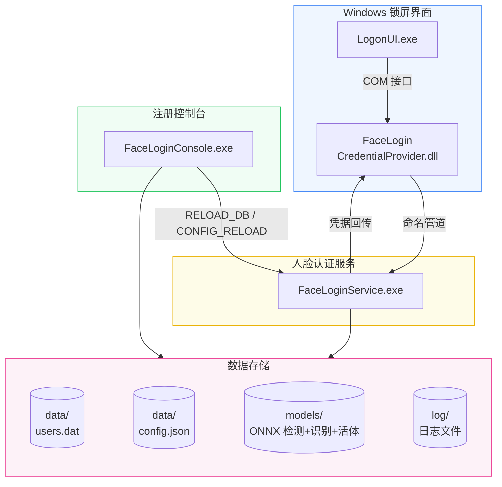

<p align="center">
  
</p>

<p align="center">
  基于 Windows Credential Provider 框架的摄像头人脸识别解锁系统。<br>
  在锁屏界面集成"人脸登录"磁贴，看一眼即可解锁 — 支持本地账户和微软在线账户 (MSA)。
</p>

<p align="center">
  <a href="LICENSE"></a>
  <a href="DEVELOPMENT.md"></a>
  <a href="DEVELOPMENT.md"></a>
  <a href="https://github.com/Link2323/FaceLogin/releases"></a>
</p>

---

## 特性

<div align="center">

| 🎯 多角度识别 | 🔒 双重活体检测 | ⚡ ONNX 高性能 |
|:---:|:---:|:---:|
| 正面 + 左右 30° 三角度录入<br>**大范围侧脸/偏头稳定识别** | MiniFAS V2 + V1SE 融合<br>防照片/视频/面具攻击 | SCRFD 检测 + InsightFace<br>ONNX 全流程本地推理 |

| Windows 原生锁屏集成 | 多账户支持 | 安全存储 |
|:---:|:---:|:---:|
| 坐在电脑前即可解锁<br>无需额外操作 | 本地 + 微软在线账户<br>每账号多张人脸 | DPAPI 加密 + 管道 DACL |

</div>

> **关于多角度识别**：本 fork 的核心增强。传统单正脸录入在用户偏头、侧对摄像头时极易误拒；本版本支持录入正面、左转 30°、右转 30° 三个角度，认证时三角度模板协同匹配，**显著扩展了可识别的头部姿态范围**，侧脸场景下的解锁成功率大幅提升。

---

## 系统架构



---

## 快速开始

### 第一步：安装

从 [Releases](https://github.com/Link2323/FaceLogin/releases) 下载 `FaceLoginSetup.exe`，运行后选择安装目录（建议保留默认的 `C:\Program Files\` 以获得系统级 ACL 保护），点击 **安装**。

### 第二步：录入人脸

以管理员身份运行 `FaceLoginConsole.exe`，按提示完成活体检测，输入密码，点击 **保存并录入**。除正脸外，可继续录入左右 30° 侧脸角度以获得更稳定的识别。

### 第三步：解锁

`Win + L` 锁屏后，注视摄像头，系统自动识别并解锁。

### 卸载

运行安装程序切换到 **卸载** 标签页，或手动执行 `regsvr32 /u FaceLoginCredentialProvider.dll`。

---

## 系统要求

| 要求 | 详情 |
|---|---|
| 操作系统 | Windows 10 21H2+ / Windows 11 (x64) |
| CPU | 桌面级 8 核+（Ryzen 7/9、Intel i7/i9 等，见下方性能说明） |
| 摄像头 | USB 或内置，支持 1280×720 |
| 运行时 | WebView2（Windows 11 内置，Win10 自动安装） |
| 权限 | 管理员权限（安装和注册需要） |
| 磁盘空间 | ~80 MB |

---

## 安全设计

| 层面 | 措施 |
|---|---|
| 进程通信 | 命名管道 DACL：仅 SYSTEM + Administrators，拒绝远程 |
| 凭据存储 | DPAPI `CRYPTPROTECT_LOCAL_MACHINE` 机器范围加密 |
| 内存保护 | 密码使用后 `SecureZeroMemory` 即时擦除 |
| 活体检测 | MiniFASNetV2 + MiniFASNetV1SE 50/50 融合，固定 5/5 帧验证 |
| 匹配安全 | 欧氏距离阈值 + 最佳/次佳匹配比双重校验 |
| 模型完整性 | 4 个 ONNX 模型启动时 SHA-256 校验，篡改/损坏即 fail-closed（拒绝认证） |
| 日志脱敏 | AUTH_SUCCESS 凭据载荷不再写入日志 |
| 编译加固 | ASLR、DEP、CFG、64位高熵地址随机化 |

---

## 性能说明

解锁耗时主要取决于 CPU 性能与散热状况。实测参考：

| 机器类型 | 端到端解锁 | 实测机型 |
|---|---|---|
| 高性能桌面 CPU | **~0.8s** | Ryzen 9 7945HX（16C/32T） |
| 笔记本（热降频时） | **~1.6s** | i7-1360P（6P+8E） |

> 混合架构 CPU（P+E 核）服务自动将推理线程绑定到性能核，无需手动配置；散热良好可明显提升解锁速度。

---

## 项目结构

```
FaceLogin/
├── common/                 # 公共库（日志、IPC协议、DPAPI、配置）
├── credential_provider/    # Windows 凭据提供程序 COM DLL
├── face_service/           # 人脸识别 Windows 服务
├── enrollment_app/         # 人脸录入控制台（WebView2 GUI）
├── installer/              # Go Wails 图形安装程序
├── scripts/                # 辅助脚本（模型下载、安装/卸载）
└── assets/                 # 图标资源
```

详细技术文档请参阅 [DEVELOPMENT.md](DEVELOPMENT.md)。

---

## 从源码构建

> 仅当需要自行编译时才需关注本节。

### 前置条件

- **Visual Studio 2022**（含 C++ 工作负载）
- **vcpkg** — onnxruntime（v1.6 起 dlib 已完全移除，图像容器/缩放/裁剪为自研 `common/frame_image.h`）
- **Go 1.21+** + **Wails v2**（仅安装程序）
- **CMake 3.20+**

### C++ 组件

```powershell
# vcpkg 依赖（人脸检测/识别/活体全部用 ONNX；图像容器/缩放/裁剪见 common/frame_image.h）
vcpkg install onnxruntime --triplet x64-windows

# 构建（VS 2022）
cmake -B build -S . -G "Visual Studio 17 2022" `
    -DCMAKE_TOOLCHAIN_FILE="$env:VCPKG_ROOT/scripts/buildsystems/vcpkg.cmake"
cmake --build build --config Release
```

> 在 VS 2026（MSVC 19.5x）上构建时，必须加 `--parallel 1`（不要加 `/MP`）：根 `CMakeLists.txt` 为该工具集关闭了 MSBuild 文件跟踪与排队错误遥测，否则会出现零 CPU 的孤立 `cl.exe` 进程。VS 2022 保持其常规 `/MP` 增量构建行为，命令不变。

### Go 安装程序

```powershell
cd installer/FaceLoginSetup
# 将 C++ 产物和模型放入 resources/ 后编译
wails build -clean -platform windows/amd64
```

### 模型文件

| 文件 | 用途 |
|---|---|
| `det_10g_gnkps.onnx` | SCRFD 人脸检测 + 5 关键点（对齐用） |
| `w600k_r50.onnx` | InsightFace ResNet50 512 维人脸嵌入 |
| `MiniFASNetV2.onnx` | 反欺诈活体检测（2.7× 裁剪） |
| `MiniFASNetV1SE.onnx` | 反欺诈活体检测（4.0× 裁剪） |

> 模型均经 INT8 量化优化（体积与速度兼得，精度无损），由 `scripts/download_models.ps1` 准备。

---

## 贡献

欢迎提交 Issue 和 Pull Request！

- 代码规范：C++20、`/W4` 警告级别
- 提交前请确保构建通过
- 重大改动请先创建 Issue 讨论

---

## 开源协议

[MIT License](LICENSE) © 2026 美国伐木工&EthanZer0

---

## 免责声明

本软件通过人脸识别辅助 Windows 登录，但 **不能替代** 密码。人脸识别为便捷方式，系统始终保留密码登录作为后备。请勿在安全要求极高的环境中单独依赖人脸识别。
